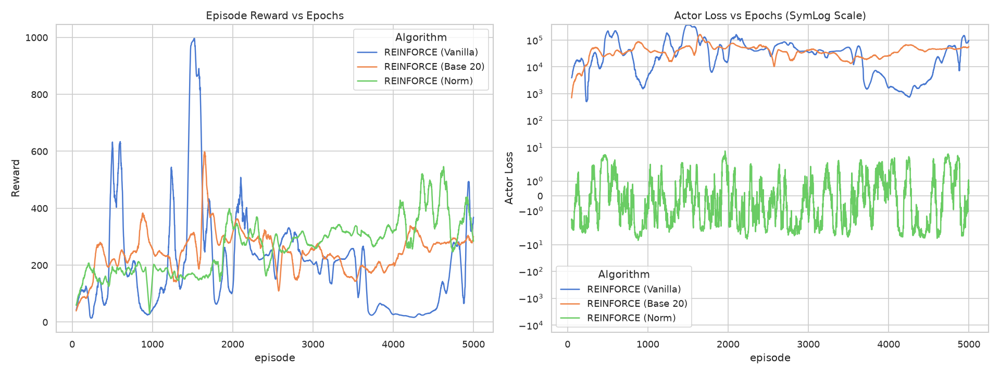
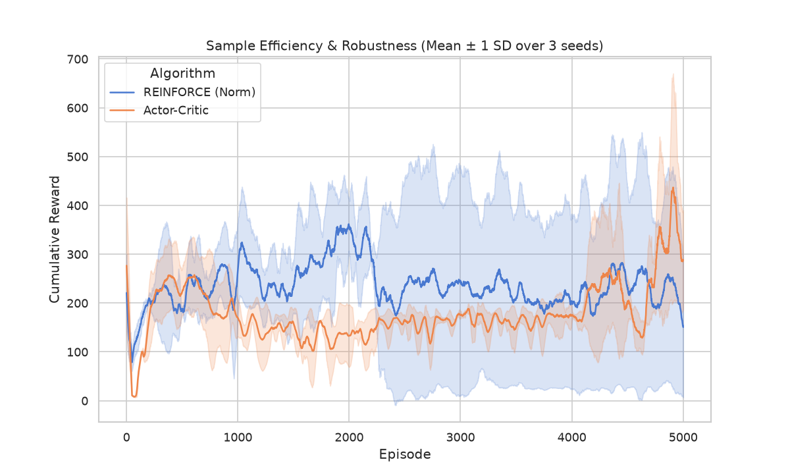
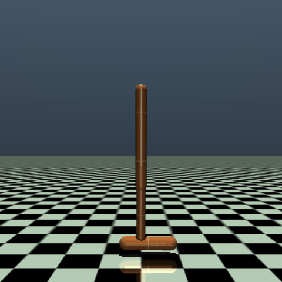
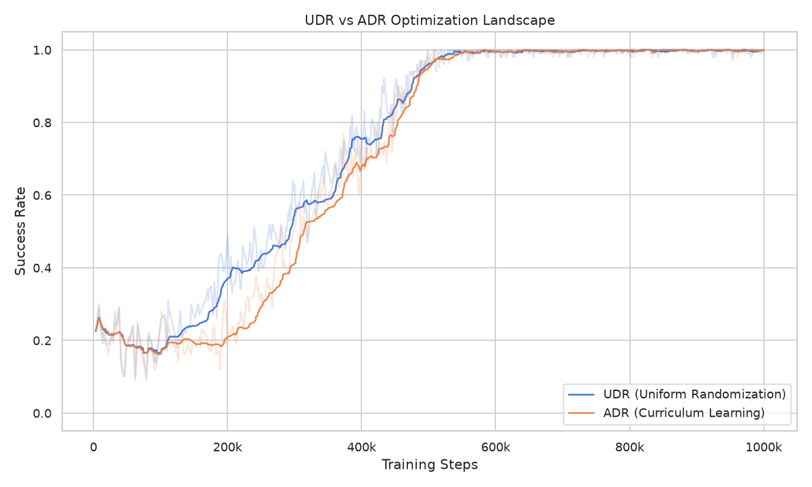

# Deep Reinforcement Learning for Continuous Control & Sim-to-Real Transfer

   

*An engineering study on continuous control: bridging the gap between mathematical foundations (Policy Gradient methods) and industrial applications (Domain Randomization in robotic manipulation)*

## Overview
This project explores the fundamentals of Deep Reinforcement Learning (DRL) applied to continuous control tasks through two distinct phases:

1. **Algorithmic Foundations**: Implementing core Policy Gradient methods from scratch to analyze the mathematical bottlenecks in the highly unstable `Hopper-v4` environment.
2. **Sim-to-Real Transfer**: Using state-of-the-art libraries to train robust policies on a robotic arm (`PandaPush-v3`). The goal is to train an agent in a source simulated domain (ligh object) and successfully deploy it in a target domain (heavy object) using Domain Randomization.

To ensure enterprise-level code quality, the architecture is modular. Neural Network, RL mathematical engines, and the Training CLI are decoupled using OOP and Strategy/Factory patterns. Experiments configurations are fully managed via `.yaml` files.

> **About this project**: This repository was developed as the final project for the *Fundamentals of Artificial Intelligence, Machine and Deep Learning (FAIML)* course within the Data Science and Engineering Master's degree at **PoliTO**. While fulfilling academic requirements, the codebase was intentionally structured to reflect industry-standard software engineering and MLOps best practices.

---

## TL;DR

If you are just browsing, here are the core engineering achivements of this repository. Click on the links to jump directly to the analysis:

* **[Mathematical Profiling](#part-1-policy-gradient-methods-reinforce-vs-actor-critic):** Built custom PyTorch engines for REINFORCE and Actor-Critic to empirically demonstrate gradient variance, the temporal credit assignment problem, and neural network exploration anomalies (the $\sigma$ spike).
* **[End-to-End Sim2Real Pipeline](#part-2-state-of-the-art-pipelines--sim-to-real-transfer):** Engineered an accelerated RL pipeline integrating **Stable-Baseline3 (SAC/PPO)** and multiprocessing (`SubprocVecEnv`), boosting environment interaction speed from 50 to 600+ FPS.
* **[Critical Data Analysis](#zero-shot-generalization--reality-gap-anomaly):** Evaluated models across multiple seeds to expose algorithmic flaws (Catastrophic Forgetting) and uncovered a "Zero-Shot Transfer Anomaly", proving that the Reality Gap manifests in kinematic inefficiency (Mean Return) rather than binary success rates.
* **[Physics Engine Interventions](#domain-randomization-as-an-architectural-proof-of-concept-poc):** Developed custom `gym.Wrapper` classes to enforce strict success criteria (solving simulator loopholes like the "Buzzer Beater" effect) and injected dynamic **Uniform (UDR)** and **Automatic Domain Randomization (ADR)** to implement Curriculum Learning on varying payload masses.

---

## Part 1: Policy Gradient Methods (REINFORCE vs. Actor-Critic)

The first phase involved implementing two foundational Policy Gradient algorithms from scratch to understand the mathematical mechanics, and practical limitations, of continuous robotic control.

### REINFORCE

REINFORCE relies of Monte Carlo returns, meaning the agent evaluates an action based on the cumulative reward of the entire episode.

* **Gradient Explosion & Statistical Normalization:** Wihtout return normalization, Vanilla REINFORCE exhibits unbounded grandient variance. As a episode lenghts increse, the Actor Loss scales disproportionally (frequently exceeding $100k$). By statistically normalizing the episodic returns, we creates a dynamic baseline, successfully bounding the loss ($\approx [-50, 50]$) and stabilizing the gradients. However, this stabilitization induces **Risk Aversion**: the agent converges to a safe, sub-optimal local minimum (plateauing at $\approx 300$ reward).
* **Extreme Seed Sensitivity:** Despite normalization, multi-seed evaluations revealed massive algorithmic variance. Because Monte Carlo returns sum all rewards (good and bad) across an episode, the optimization path is highly susceptible to initial conditions and environmental stochasticity. This results in wide confidence intervals, making the algorithm's performance highly unpredictable.
* **The Temporal Credit Assignment Problem:** The core limitation of REINFORCE is its inability to assign credit to specific state-action pairs. An optimal propulsive action at step 10, followed by a mechanical failure at step 400, results in the entire trajectory being penalized, fundamentally hindering sample efficiency and convergence.

*Figure 1: Ablation study demonstrating unbounded gradient variance in Vanilla REINFORCE and stability induced by normalization.*

### Actor-Critic

To address the credit assignment problem, a Value Fcuntion (the Critic) is introduced to compute the 1-step Temporal Difference (TD) Error (Advantage), shifting from high-variance global returns to low-variance local evaluations.

While Actor-Critic theoretically mitigates the high variance of REINFORCE, empirical testing revealed the **optimization fragility** of foundational on-policy methods in continuous domains.

* **Variance Reduction vs. Premature Convergence:** Actor-Critic successfully drastically reduces the optimization variance in the early-to-mid stages of training (demonstrated by a much narrower standard deviation compared to REINFORCE). However, this stability induces **Risk Aversion**. The agent prematurely converges to a sub-optimal local minimum (plateauing at $\approx 200$ reward), learning a passive balancing strategy to survive rather than exploring forward locomotion.
* **Catastrophic Policy Collapsing:** Because Vanilla Actor-Critic updates the policy *online* without constraints (e.g., Trust Regions), taking a gradient step based on a poorly estimated Advantage can instantly corrupt the Actor's weights. We observed late-stage training instability where the policy forgets its learned behavior, causing the reward to drop precipitously.
* **The Ascending $\sigma$ Anomaly:** By continuously logging the mean standard deviation ($\sigma$) of the Actor's action distribution, we observed a counter-intuitive phenomenon during policy degradations. Instead of monotonic exploration decay (where $\sigma \to 0$ as the policy becomes confident), $\sigma$ frequently spiked back to high values. Mathematically, this acts as a network compensation mechanism: once the learned action mean ($\mu$) is corrupted and leads to failure, the optimization process drastically inflates the exploration noise ($\sigma$) in a blind attempt to escape the deteriorating policy space.

*Figure 2: Multi-seed evaluation demonstrating the variance reduction of Actor-Critic, although also its premature convergence and the extreme high variance of REINFORCE (even with normalization).*

### Qualitative Results (Evaluation on Trained Agents)

| REINFORCE (Normalized) | Actor-Critic |
|------------------------|--------------|
|  |  |

* **REINFORCE Best-Checkpoint Bias:** Due to high variance, the saved "best model" represents a lucky outlier trajectory.
* **Actor-Critic Stable but Risk-Averse:** Converges to a safe local minimum. The agent balances perfectly on the spot to avoid falling, but refuses to move forward.

---

## Part 2: State-of-the-Art Pipelines & Sim-to-Real Transfer

### Algorithm Selection & MLOps Pipeline

To establish a robust pipeline for continuous control, both **PPO** and **SAC** were evaluated using `Stable-Baselines3`. Empirical testing revealed that PPO was highly brittle and extremely sensitive to hyperparameter configurations, failing to converge on the tested environment with default settings. Conversely, SAC successfully solved the environment even with its base configuration, converging in approximately 5 hours

To optimize the MLOps pipeline, SAC's hyperparameters were fine-tuned. This tuning drastically accelerated sample efficiency, reducing the training time to under 1 hour for 1,000,000 timesteps. The entire training phase was continuously monitored using **TensorBoard**.

### Zero-Shot Generalization & Reality Gap Anomaly

Due to computational constraints, the core training was executed solely on `seed=42` within the `source` environment (1.0 kg mass). However, to rigorously test for seed sensitivity and prevent *lucky checkpoint bias*, the evaluation phase was systematically executed across multiple random seeds on the `target` environment (5.0 kg mass) to establish the **Sim-to-Real Lower Bound**.

The naïve transfer evaluation yielded success rates of **86%, 96%, 98%, and 100%**. Contrary to the expectation of a catastrophic failure, the vanilla SAC policy demonstrated exceptional zero-shot generalization. This anomaly indicates that the `PandaPush-v3` environment is dynamically too simple: relying solely on a single parameter shift (mass +4kg) without compounding complexities (e.g., variable surface friction or obstacles). This allowed SAC to learn an over-actuated brute-force policy capable of overpowering the inertial differences.

*Note:* While the binary success metric was easily achieved, a deeper analysis of the **Mean Return** revealed a significant kinematic degradation and increased variance on the heavier target. This proves that the reality gap still negatively impacts the agent's efficiency, even if it does not cause absolute task failure.

### Domain Randomization as an Architectural Proof of Concept (PoC)

Given that the baseline agent already generalized optimally, implementing advanced Sim-to-Real techniques to "improve" the success rate became mathematically redundant. However, to fulfill the PRD requirements, **Uniform Domain Randomization (UDR)** and **Automatic Domain Randomization (ADR)** were implemented as an architectural PoC.

By developing custom `gym.Wrapper` classes, dynamic mass randomization was injected during the environment reset phase:
* **UDR:** Subjected the agent to the full mass range (1.0 - 5.0 kg) immediately, resulting in a high-variance optimization landscape and slower convergence.
* **ADR (Curriculum Learning):** Dynamically expanded the mass distribution only when a strict success threshold (80% over 20 episodes) was met. As shown in the TensorBoard rollouts above, ADR provided a smoother learning curve by keeping the agent within its proximal zone of development.